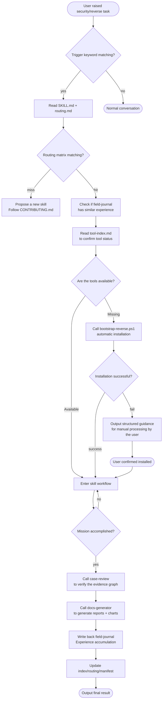
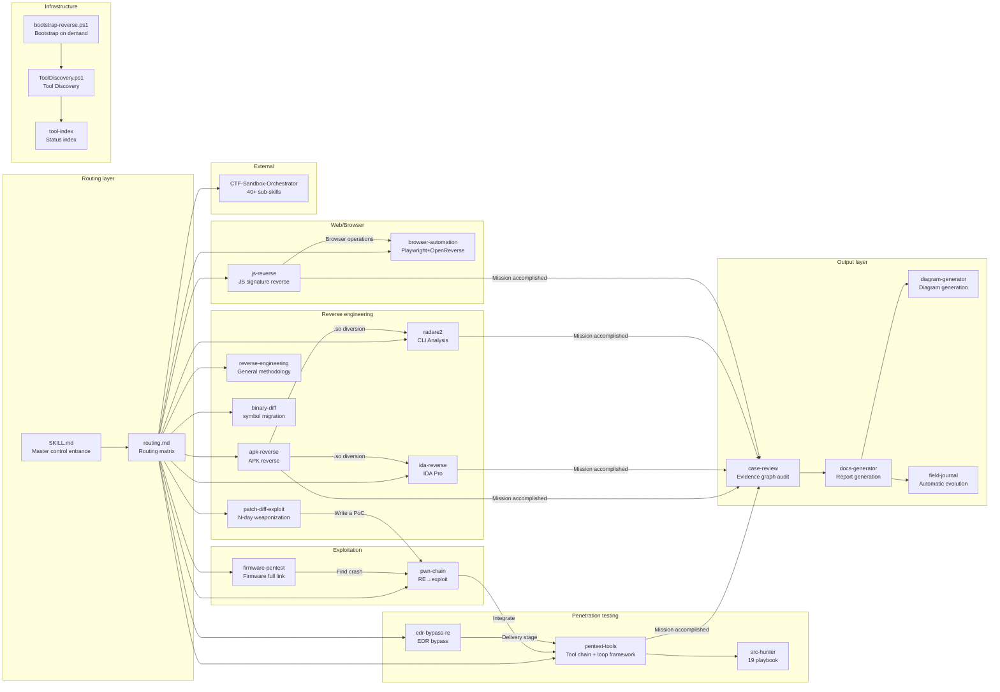
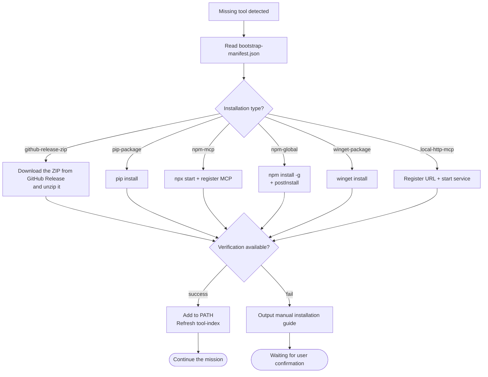
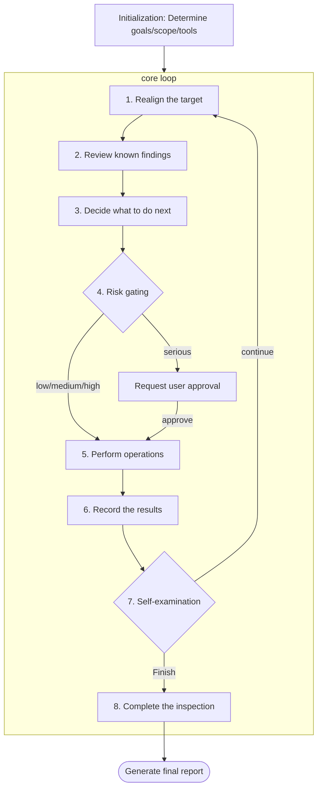
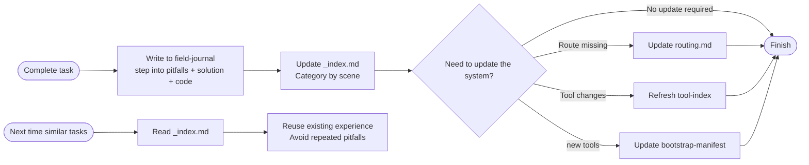
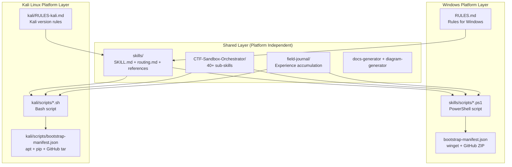
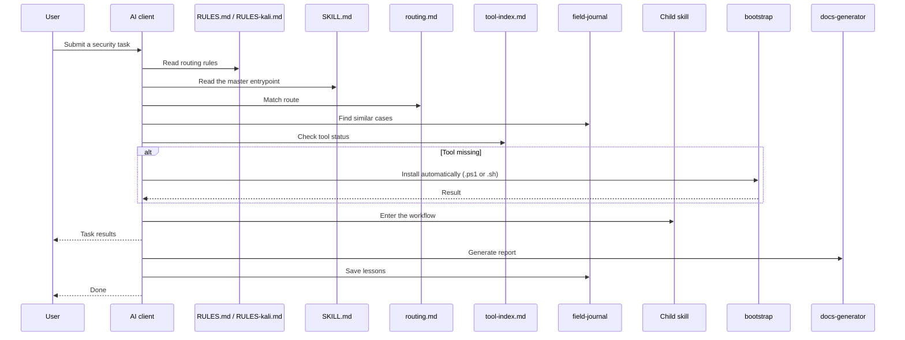

# System architecture diagram

## Complete behavior chain flow chart

## Skills module relationship diagram

## Bootstrap bootstrapping process

## Penetration testing cycle

## automatic evolution mechanism

## Multi-platform support architecture

### Platform selection logic

| environment Rule file used by | Script used by | | Package management |
|------|--------------|-----------|--------|
| Windows | `RULES.md` | `skills/scripts/*.ps1` | winget / GitHub Release ZIP |
| Kali Linux | `kali/RULES-kali.md` | `kali/scripts/*.sh` | apt / pip / npm / GitHub tar.gz |

### Kali version features

- **A large number of tools pre-installed**: nmap, sqlmap, hashcat, hydra, metasploit, radare2, binwalk, burpsuite, etc. do not require bootstrap
- **apt unified management**: No need for winget or manual decompression of ZIP
- **bash native**: more concise scripts, no PowerShell dependencies
- **Path specification**: `/usr/bin/`, `/opt/`, `~/tools/`, no drive letter or space issues

## File reading timing diagram

