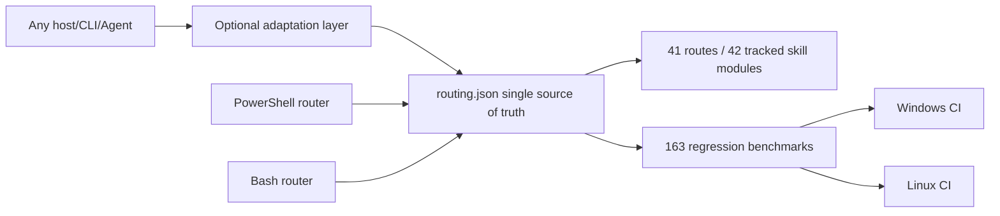

# PR #43 / #37 / #36 / #23 Local Review and Integration Report

- Date: 2026-08-08
- baseline: `origin/main` at `6315d02`
- Review Branch: `codex/review-pr-43-37-36-23`
- scope: only review the incremental value of four PRs relative to the current main line; do not perform external target actions
- Conclusion: All four PRs have reusable value, but only #43 and #37 are suitable for retention; #36 and #23 must be selectively integrated with

## Executive Summary

| PR | Relative mainline value | Integration decision | Key boundary |
|---|---|---|---|
| #43 | Very high | Preserve structured routing, 163 current regression baselines, dual platform CI, supply chain pin gate, dynamic index | Remove OpenCode configuration, installer and dedicated agent; core does not bind any clients |
| #37 | High | merges case-review, evidence map review, hash verification and single test, and adds R40 | Accepts both `done` and the currently agreed `completed` |
| #36 | Medium High | Selective merge Burp reconnect/newline message processing, atomic token, Anything Analyzer authentication, process tree and sudo home fix | rejects semantic rollbacks such as "all capabilities are ready" |
| #23 | Medium (low overall package) | Only merges Bash case-init, case-guard, structured Bash routing and CI parity | Excludes client manifests, GIFs, demo spawns and hardcoded route copies in 92 files |

## platform boundary

The only source of truth for  structured routing is `skills/config/routing.json`. Both the PowerShell and Bash portals read this file; the hosting client is only allowed to exist as an optional adapter and cannot determine the repository identity, routing rules, test bases, or installation paths.

## review findings and corrections

1. The design value of #43 comes from structured data and automated access control, not OpenCode access. All OpenCode-specific files and CI jobs have been removed.
2. The original implementation of #37 only recognizes `done` and will misjudge `completed` used in the main line as incomplete; it has been supplemented to be compatible with the 7th single test.
3. #36's bridge reconnection and token writing are net gains; its ability status rewriting will create false positives and is not merged.
4. The Bash router of #23 copies the hardcoded table as is, which immediately drifts with the R40/priority of #43; has been rewritten to read `routing.json` and verify the R1/R3/R40 parity in CI.
5. new supply-chain gate exposes 7 floating installation sources of Kali manifest. Fixed Frida 14.10.4, IDA MCP commit, Agent Browser 0.31.1, ProxyCat commit, Nuclei v3.8.0, pwntools 4.15.0 and make the install command actually use these pins.
6. After was pushed, a forced review found that Bash `case-init` did not inherit the CaseName path constraint; paths, control characters, wildcards, and trailing dots/spaces were rejected, and negative CIs were added.
7. The authorization URL for Bash was mistakenly dropped into `offline` and may be ready; it has been aligned with PowerShell as `authorized_target_only`, and is explicitly offline to only accept local samples.
8. Bash `case-guard` now only takes values ​​from the corresponding chapters of `auth`, `network_profile`, and `signoff`. The pseudo fields in notes/evidence cannot pass the gate.
9. Kali ProxyCat fixed source installation now generates a detectable `~/.local/bin/proxycat` wrapper; CI checkout is also fixed from variable tag to v4.2.2 commit.
10. The original dynamic INDEX of mistakenly included 12 local modules excluded by `.gitignore` in the development machine, and clean clone will fail; the generator now only enumerates Git tracked skills, clean clone and workspace with private extensions are stable at 42 core modules.

## is a quantitative improvement compared to the old main line

 uses the same set of 163 benchmarks to call the old mainline hard-coded router and the new structured router respectively, each running in a separate PowerShell process:

| Version | Passed | Accuracy | No output |
|---|---:|---:|---:|
| Old mainline `6315d02` | 137 / 163 | 84.05% | 0 |
| Current structured implementation | 163 / 163 | 100% | 0 |

 definitely adds 26 correct routes, an increase of 15.95 percentage points. Improved coverage of Frida/Android, certificate and root detection, packet capture replay, ransomware, Burp/Metasploit, Go binary, BLE, USB, native `.so`, memory dump and other scenarios where old implementations will fall back to R0.

## verification result

| Verification item | Result |
|---|---|
| Structured routing full regression | 163 / 163 by |
| routing consistency and supply chain pin gate | by |
| PowerShell smoke | by |
| P0 friction / scope-guard regression | by |
| Old version/new version 163 items A/B | 137/163 → 163/163 |
| case-review Python single test | 7 / 7 by |
| Burp bridge Node Return | 1 / 1 by |
| Bash router/case-init/case-guard parity | by |
| PowerShell, Bash syntax, and JSON parsing | via |
| Java compilation check | Gradle 8.7 distribution download is blocked by native certificate revocation network; instead use Maven Central's declared dependency with JDK 21, `McpHttpServer.java` compiles through |

## Residual risk

- Bash structured routing relies on Python 3; this is an explicit runtime dependency, but avoids a second routing table.
- The fixed dependency version of needs to be upgraded periodically and explicitly, and no longer implicitly follows `latest`.
- The client adaptation can still continue to be expanded, but the core data must remain completely host-independent of the tests.
- has not completed the Gradle task layer test on this machine; the reason is that the 128 MB wrapper distribution download is blocked by the certificate revocation network and low-speed links. The same version of dependencies has been used to complete the independent compilation check of the modified Java source files.

## finally recommends

 merges the selective results of the current review branch without merging the original package form of the four PRs. Subsequent PRs should be split according to "Core Routing/Host Adaptation/Demo Assets/Documents" to facilitate independent review and rollback.
