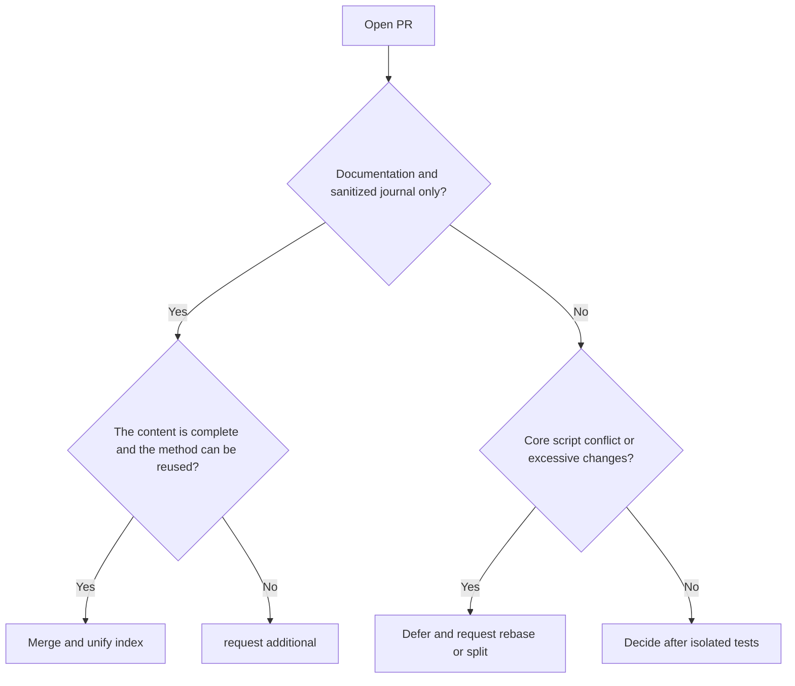

# 2026-08-08 Open PR value evaluation and merger report

## in conclusion

Review of 8 open PRs based on latest `origin/main`. This round merges #59, #19, #22, #29; suspends #43, #37, #36, #23. The merged smoke and routing coherence checks both pass.

## Assessment results

| PR | Value | Risk/Status | Decision |
|---|---|---|---|
| #59 | Rust cdylib differential reproduction method is complete and highly reusable | Only journal and index, no executable code | Merge |
| #19 | Windows 24H2 tool chain compatibility experience covers wide | journal and index only | merge |
| #22 | Electron/Bytenode/Update chain analysis method complete | Only journal and index | Merge |
| #29 | Next.js dual API serializer and contract reconstruction experience complete | journal and index only | merge |
| #43 | Routing single source of truth, regression baseline, CI and version fixation are of high value; client access can only be used as an optional adaptation layer | 38 files, conflicts with 4 key files of the main line, the original proposal contains OpenCode-specific configuration | Suspended, special review after rebase is recommended; the core must not be bound to OpenCode |
| #37 | evidence graph/case review can complete the delivery audit | conflicts with the main line routing checksum document | suspended, it is recommended to rebase and then run its single test |
| #36 | MCP/bootstrap security reinforcement is in the right direction | 6 key files conflict, some capabilities have been absorbed by the recent mainline | Suspended, do differential deduplication |
| #23 | Bash parity and display materials have ecological value | 92 files, many display assets, 2 script conflicts | Suspended, recommended to split PR |

## decision chart

## verify

- `skills/scripts/smoke.ps1`: ALL PASS (9 script parsing, 8 routing use cases).
- `skills/scripts/verify-routing-coherence.ps1`: ALL ROUTING COHERENCE CHECKS PASSED。
- The user's original uncommitted journal is saved and restored through stash isolation during synchronization and merging.

## Follow-up suggestions

1. Prioritize #43 rebase to the current `main`, focusing on reviewing JSON routing equivalence, supply chain pin gate and cross-platform paths.
2. Let #37 rebase alone and run `skills/case-review/tests/test_review_case.py`.
3. File-by-file comparison of #36 with merged security fixes, extracting only tests or boundary treatments not yet covered.
4. Split #23 into three independent PRs for Bash parity, plugin metadata, and demo assets.
